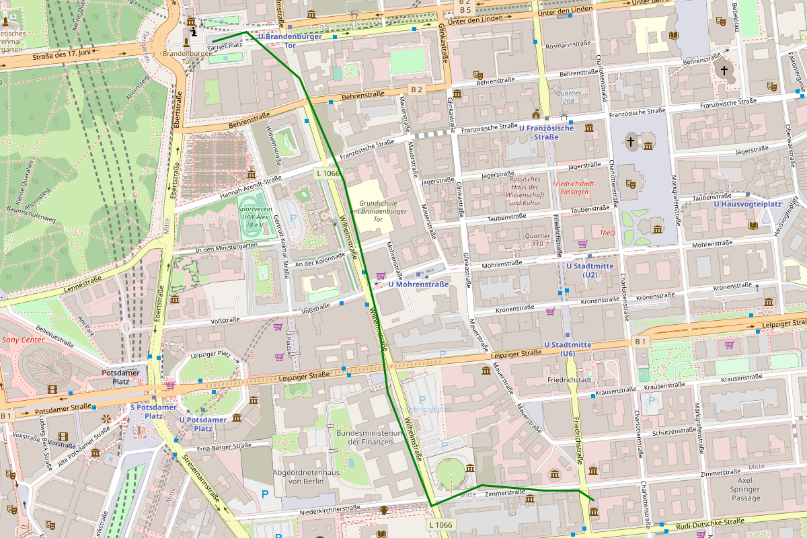

# `geojson-renderer`

[](https://maven-badges.herokuapp.com/maven-central/berlin.softwaretechnik/geojson-renderer_2.13)

`geojson-renderer` is a command-line tool that renders
[GeoJSON](https://geojson.org/) documents to SVG images, with map tiles in the
background and the described geometries on top of the map.

For example, the following
[input](<https://flexivis.infrastruktur.link/?layout=(explanation30-map)/source&explanation=md:https://raw.githubusercontent.com/programmiersportgruppe/flexivis/master/docs/samples/berlin-walk.md&map=map:https://raw.githubusercontent.com/programmiersportgruppe/flexivis/master/docs/samples/berlin-walk.json&source=json:https://raw.githubusercontent.com/programmiersportgruppe/flexivis/master/docs/samples/berlin-walk.json>):

```json
{
    "type": "Feature",
    "geometry": {
        "type": "LineString",
        "coordinates": [
            [13.3907, 52.5074],
            [13.3902, 52.5076],
            [13.3891, 52.5076],
            [13.3871, 52.5077],
            [13.3855, 52.5073],
            [13.3841, 52.5095],
            [13.3838, 52.5109],
            [13.3827, 52.5136],
            [13.3813, 52.5156],
            [13.3796, 52.5165],
            [13.3785, 52.5163]
        ]
    },
    "properties": {
        "stroke": "green"
    }
}
```

...would produce an [SVG image](examples/berlin-walk.svg) that looks like:



## Getting started

`geojson-renderer` is distributed with a
[`jlauncher`](https://github.com/softwaretechnik-berlin/jlauncher) manifest,
i.e. it can be run without manual download once `jlauncher` is installed. To
install it, run:

```bash
gem install jlauncher
```

See `jlauncher`'s page for more details on installing it.

Then `geojson-renderer` can be executed like so:

```bash
j berlin.softwaretechnik:geojson-renderer_2.13:0.0.4 --dimensions 600x200 example.geojson
```

If the input file is valid, an SVG file will be written next to it with the
relevant file extension.

To learn more about the options, a `--help` flag is available:

```bash
j berlin.softwaretechnik:geojson-renderer_2.13:0.0.4 --help
```

```
Usage: geojson-renderer [OPTION]... [input-file]
geojson-renderer renders a geojson file to svg and optionally to png.

Options:

  -d, --dimensions  <arg>          The dimensions of the target file in pixels.
  -p, --png                        Render the resulting svg into png.
  -t, --tile-url-template  <arg>   Template for tile URLs, placeholders are
                                   {tile} for tile coordinate, {a-c} and {1-4}
                                   for load balancing.
  -h, --help                       Show help message

 trailing arguments:
  input-file (required)   Geojson input file.
```

## How it Works

`geojson-renderer` creates an SVG image with the GeoJSON features and adds map
tiles in the background, so that the features are displayed on top of the map
view.

Currently, the tiles are included using SVG image tags containing URLs pointing
to the actual tile. That means the tiles are downloaded when visualizing the
output SVG.

The `-p` flag allows rendering the output as a PNG file instead. This will lead
to the downloading of tiles. Underneath,
[Apache Batik](https://xmlgraphics.apache.org/batik/) is used.

Optionally, the tile source can be configured by providing a template URL where
the following parameters are supported:

- `{tile}`: the coordinate of the tile as `{z}/{x}/{Y}`.
- `{1-4}`: will be replaced with a number between 1 and 4,
- `{a-c}` will be replaced with one of the letters 'a', 'b' or 'c'.

There are several tile services based on OpenStreetMap, see
[list](https://wiki.openstreetmap.org/wiki/Tile_servers). Also, there are
services based on proprietary maps, such as the
[HERE Map Tile API](https://developer.here.com/documentation/map-tile/dev_guide/topics/introduction.html).
The use of tile servers is not generally free, so please adhere to the relevant
policies.

## Development

This project is a work in progress. Pull requests are welcome. A backlog with
more tasks is maintained at the end of this document.

`geojson-renderer` is implemented in Scala and uses the mill build tool.

### Setup

[Mill](https://github.com/lihaoyi/mill) can create an IntelliJ project:

```bash
mill mill.scalalib.GenIdea/idea
```

### Testing

There is a comprehensive integration test suite that uses live data to validate
the tool. Because of that, some tests might fail from time to time as map tiles
get updated.

We will address this at some point, by either not using tiles in the test or by
providing stable test tiles.

The tests can be run using:

```bash
mill core.test
```

### Backlog

- [ ] Add an option to embed the bitmap data into the SVG rather than to link,
      so that we get a self-contained SVG file.
- [ ] Fix SVG to PNG rendering to have proper high-res bitmaps.
- [ ] Provide our own PNG rendering that uses batik only to render the GeoJSON
      graphics and do the overlay at the bitmap level
- [ ] Provide caching for bitmap data
- [ ] Add an option(s) to write SVG embedded into html
- [ ] Add option to add scripting to SVG/HTML which adds inspection of
      properties etc.
- [ ] Add meaningful classes and IDs to SVG
- [ ] Support "GeoJSON" files with multiple feature collections.
- [ ] Add different dimension strategies. Currently we determine a bounding box
      that contains the whole GeoJSON and maintains the aspect ration of the
      given dimensions. Other strategies could be:
  - Use the given dimensions as the maximum and cut the box to the boundary of
    the GeoJSON content.
  - Specify width or height in pixels.
- [ ] Add a flag that allow specifying the output file path.
- [ ] Allow reading input GeoJSON from stdin.
- [x] Make tile source configurable for command line util in a way that is
      convenient and not violating terms of service of the tile providers.
